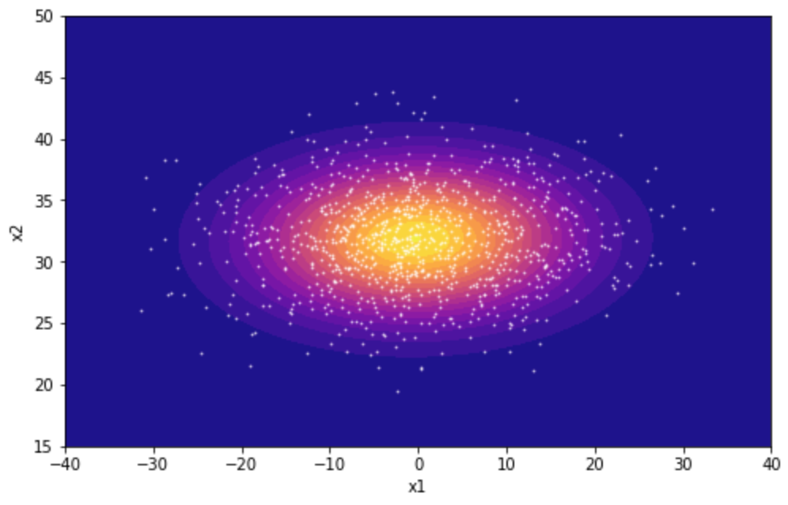
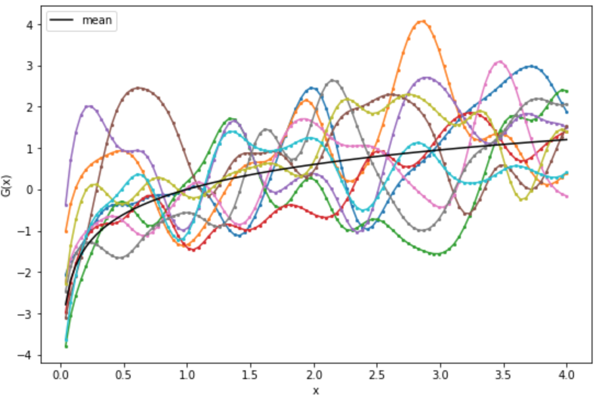
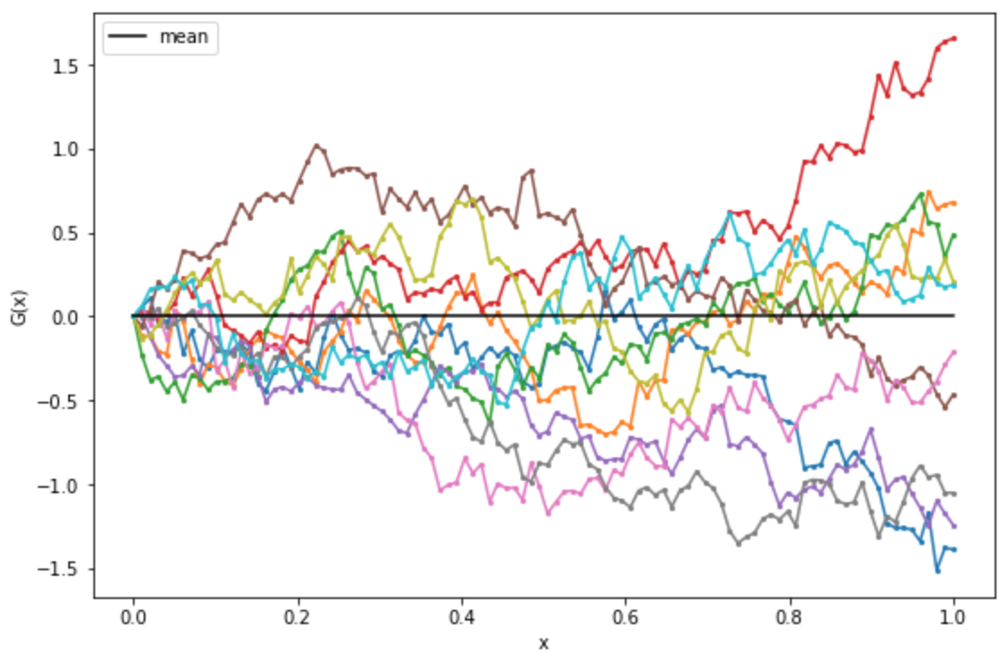
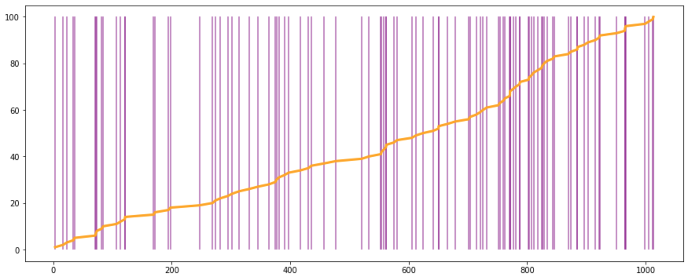
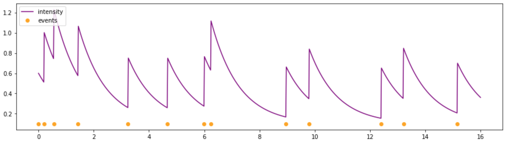
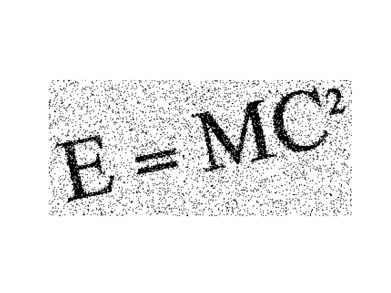
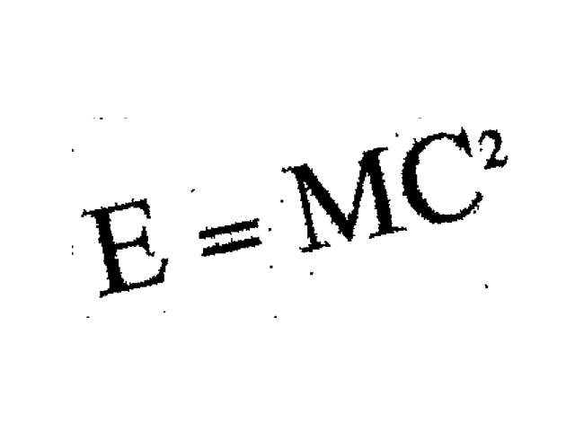

# Stochastic Processes

## Assignments

- [Stationary Stochastic Process](Assignments/HW2-Stationary-Stochastic-Process.pdf)
- [LTI & Ergodicity](Assignments/HW3-LTI-Ergodicity.pdf)
- [Point Process & Gaussian Process](Assignments/HW4-Point-Process-Gaussian-Process.pdf)
- [Estimation Theory](Assignments/HW5-Estimation-Theory.pdf)
- [Markov Chain](Assignments/HW6-Markov-Chain.pdf)

## Implementations of Stochastic Processes

[Link to notebook](SP-Code/visualization.ipynb)

This notebook includes implementations to generate stochastic processes:

Example:

- A very pretty gaussian distribution:

  

- Gaussian process with RBF kernel:

  

- Brownian motion:

  

- Poisson process:

  

- Hawkes process:

  

## Markov Chain

### Part 1

[Link to notebook](Project/Markov-Chain/hmm-final-part1.ipynb)

"Baum-Welch" algorithm is implemented to train a Hidden Markov Model parameters from
sequences of observed data.

### Part 2

[Link to notebook](Project/Markov-Chain/hmm-final-part2.ipynb)

Hidden Markov Model parameters is trained using counting from sequence of observed
data and states.
"Viterbi" algorithm is implemented to find the most probable sequence of states from
observations

## Gibbs Sampling

[Link to notebook](Project/Gibbs-Sampling/gibbs.ipynb)

Implemented Gibbs sampling to denoise an image.

Example:

  
  

